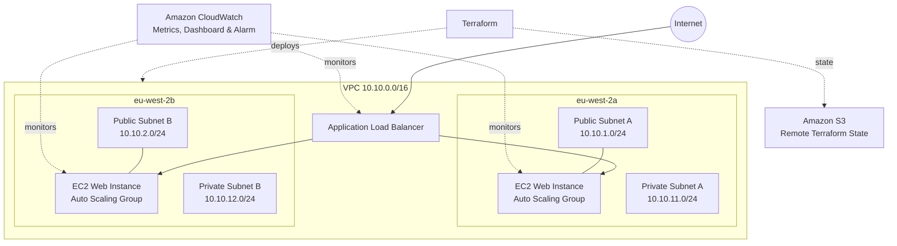

# AWS Project V1 - Highly Available Web Architecture with Terraform


## Overview


This project demonstrates the design, deployment, validation and recovery testing of a highly available AWS web architecture using Terraform.


The infrastructure is deployed across two Availability Zones in the AWS London region (`eu-west-2`) and uses an Application Load Balancer and Auto Scaling Group to distribute traffic and maintain application availability.


The project was built as a hands-on Infrastructure as Code exercise with an emphasis on networking, security, high availability, monitoring, reproducibility and operational troubleshooting.


## Architecture



The environment consists of:


\- One custom VPC (`10.10.0.0/16`)

\- Two public subnets across two Availability Zones

\- Two private subnets across two Availability Zones

\- Internet Gateway and public routing

\- Application Load Balancer

\- Auto Scaling Group

\- EC2 Launch Template

\- Apache web servers bootstrapped using user data

\- Separate ALB and web-server security groups

\- Target tracking scaling policy

\- CloudWatch monitoring and alarm

\- Terraform remote state stored in Amazon S3


### Traffic Flow


Internet → Application Load Balancer → Target Group → Auto Scaling EC2 instances


The web tier is distributed across `eu-west-2a` and `eu-west-2b`.


## High Availability


The Auto Scaling Group is configured with:


\- Minimum capacity: 2

\- Desired capacity: 2

\- Maximum capacity: 4


Instances are distributed across two Availability Zones.


During resilience testing, an EC2 instance was deliberately terminated. Auto Scaling detected the loss of capacity and automatically launched a replacement instance.


The replacement initially failed ALB health checks while the application was bootstrapping. Once Apache was installed and started by the Launch Template user data, the target became healthy and began receiving traffic.


The remaining healthy instance continued serving the application during the replacement process.


## Networking


The VPC uses the following subnet structure:


| Subnet | CIDR | Availability Zone |

| --- | --- | --- |

| Public A | 10.10.1.0/24 | eu-west-2a |

| Public B | 10.10.2.0/24 | eu-west-2b |

| Private A | 10.10.11.0/24 | eu-west-2a |

| Private B | 10.10.12.0/24 | eu-west-2b |


The public route table provides a default route to the Internet Gateway.


The private route table intentionally has no internet route or NAT Gateway in this version of the project.


## Security


The Application Load Balancer accepts HTTP traffic on port 80 from the internet.


The web-server security group accepts HTTP traffic only from the ALB security group rather than directly from the internet.


This demonstrates security-group referencing and separation between the public load-balancing layer and application layer.


The current architecture uses HTTP for demonstration purposes. A production implementation would use HTTPS/TLS and further hardening.


## Auto Scaling and Resilience Testing


The project includes a target-tracking Auto Scaling policy.


Resilience testing included deliberately terminating an ASG-managed EC2 instance and observing:


1\. The instance transition to unhealthy/terminating.

2\. Auto Scaling launch a replacement instance.

3\. The ALB remove the terminating target.

4\. The replacement initially fail application health checks during bootstrap.

5\. The replacement become healthy after Apache started.

6\. Traffic resume across healthy instances in both Availability Zones.


A subsequent Terraform plan reported no infrastructure changes because Terraform manages the Auto Scaling Group configuration rather than the individual dynamically managed EC2 instances.


## Monitoring


Amazon CloudWatch is used for operational visibility.


The project includes:


\- CloudWatch dashboard

\- Auto Scaling CPU metrics

\- ALB target-health monitoring

\- ALB request metrics

\- Alarm based on unhealthy target count


The final validation confirmed both ALB targets were healthy and the unhealthy-target alarm was in the `OK` state.


## Infrastructure as Code


Terraform manages the AWS infrastructure.


The project uses:


\- Variables

\- Outputs

\- Resource references

\- Child network module

\- Terraform state

\- Remote S3 backend

\- Native S3 state locking

\- Terraform dependency management

\- Infrastructure validation with `terraform plan`


The network components are separated into:


```text

modules/network/

├── main.tf

├── variables.tf

└── outputs.tf
